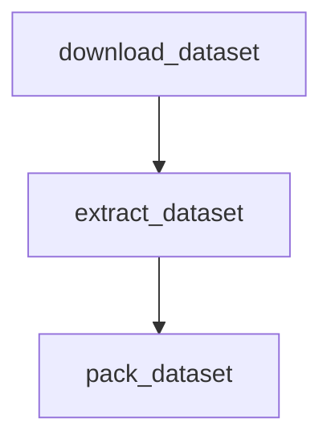
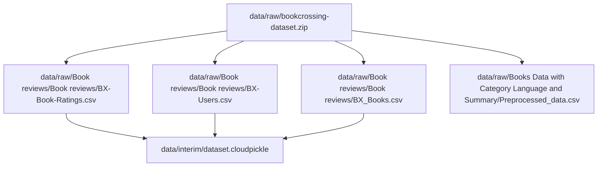

# pipeline DAG

## process DAG

```mermaid
flowchart TD
	node1["download_dataset"]
	node2["extract_dataset"]
	node3["pack_dataset"]
	node1-->node2
	node2-->node3
```

## output file DAG

```mermaid
flowchart TD
	node1["data/interim/dataset.cloudpickle"]
	node2["data/raw/Book reviews/Book reviews/BX-Book-Ratings.csv"]
	node3["data/raw/Book reviews/Book reviews/BX-Users.csv"]
	node4["data/raw/Book reviews/Book reviews/BX_Books.csv"]
	node5["data/raw/Books Data with Category Language and Summary/Preprocessed_data.csv"]
	node6["data/raw/bookcrossing-dataset.zip"]
	node2-->node1
	node3-->node1
	node4-->node1
	node6-->node2
	node6-->node3
	node6-->node4
	node6-->node5
```
